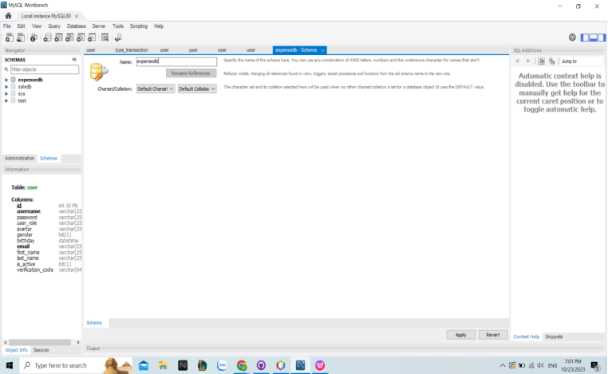
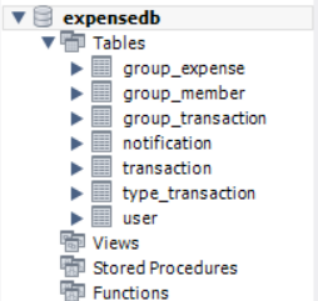
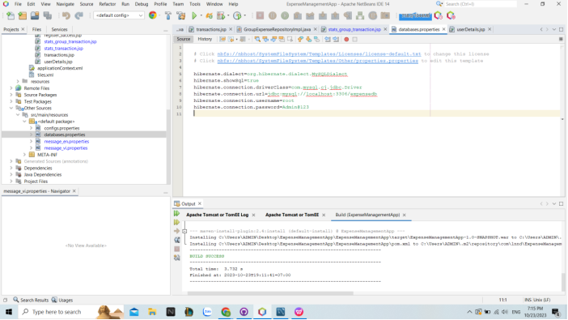
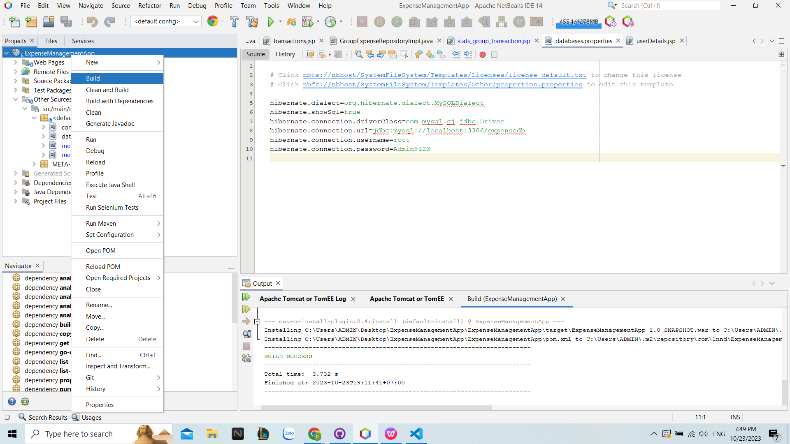
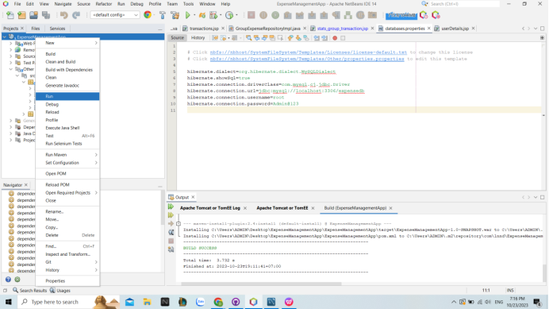
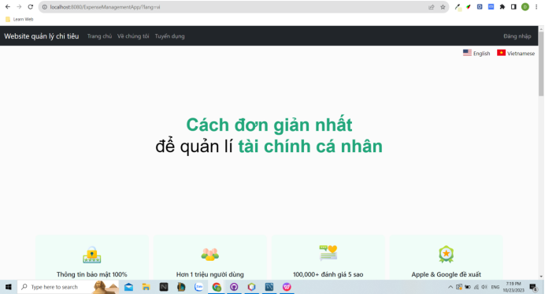

# -ExpenseManagementApp
Các phần mềm cần có:
+ JDK 20 (https://www.oracle.com/java/technologies/javase/jdk20-archive-downloads.html)
+ Apache Tomcat 9 (https://tomcat.apache.org/download-90.cgi)
+ Apache NetBeans IDE 14 (https://netbeans.apache.org/download/nb14/)
+ MySQL Workbench 8.0 CE (https://dev.mysql.com/downloads/workbench/)
#### Khởi động phần mềm:
Mở MySQL Workbench 8.0 CE:
+ Tạo mới một database với tên "expensedb"

+ Import file database:
  + Server -> Data import -> Chọn Import from Self-Contained File -> Chọn đường dẫn đến file expensedb.sql
  + Default Target Schema -> Chọn "expensedb"
  + Start Import
  
  
  + Refresh lại database và kiểm tra. Nếu xuất hiện các bảng như hình là đúng. 
#### Mở Apache NetBeans IDE 18:
+ Mở project ExpenseManagementApp
+ Mở file databases.properties và sửa username và password cho phù hợp.

+ Bấm chuột phải vào project và bấm "Build".

+ Sau khi build xong thì bấm "Run".

+ Khi thấy trang web này hiện lên trang chủ thì quá trình khởi động web thành công.

****
### Các tài khoản có trong hệ thống:
+ TK: admin   MK: 123456
+ TK: user1   MK: 123456
+ TK: user2   MK: 123456
+ TK: user3   MK: 123456
+ TK: user4   MK: 123456
+ TK: user5   MK: 123456